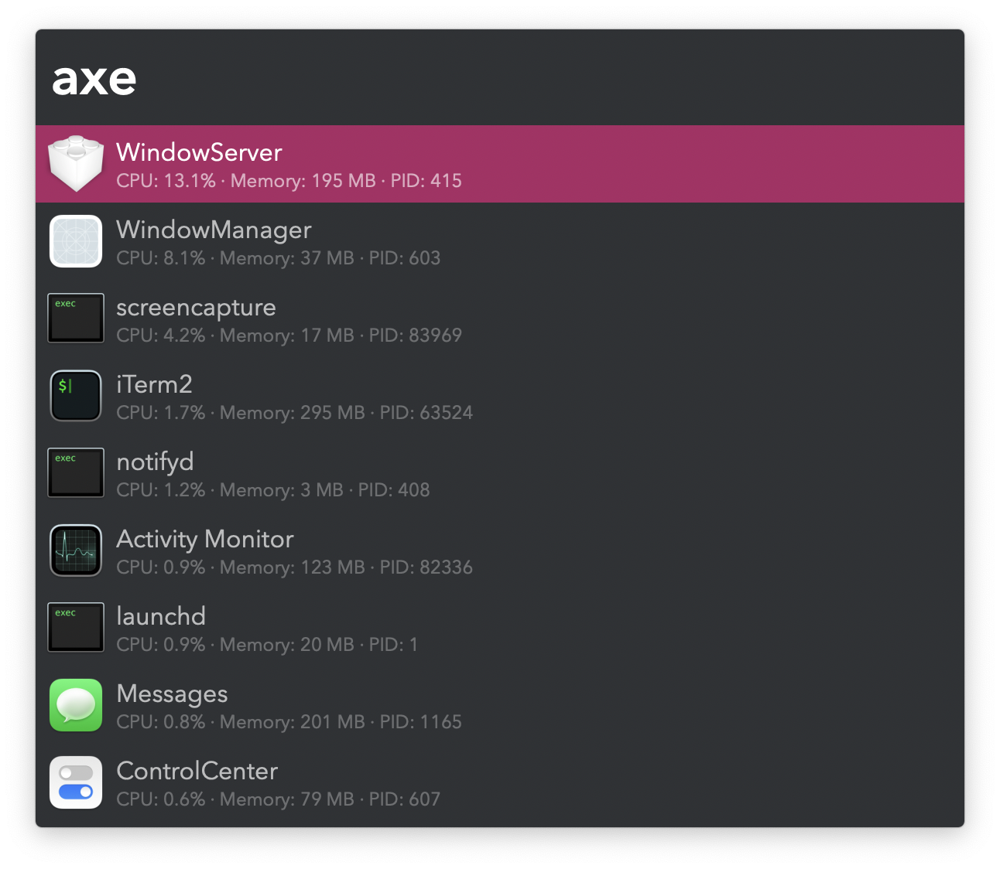

#  Axe Processes Alfred Workflow

Monitor and terminate processes

[⤓ Install on the Alfred Gallery](https://alfred.app/workflows/vitor/axe-processes)

## Usage

Search active processes, live sorted by CPU or memory usage, via the `axe` keyword.

* <kbd>↩</kbd> Ask process to terminate with TERM (software termination signal).
* <kbd>⌘</kbd><kbd>↩</kbd> Force process to terminate with KILL (non-catchable, non-ignorable kill).
* <kbd>⌥</kbd><kbd>↩</kbd> Flip sorting between CPU and memory usage.
* <kbd>⇧</kbd><kbd>↩</kbd> Pause or resume live monitoring.
* <kbd>⌃</kbd><kbd>↩</kbd> View full command in Text View.

